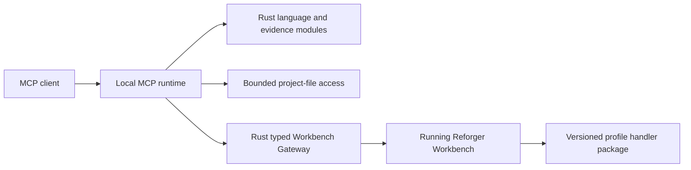

# Architecture

## Purpose

The system separates VS Code integration from language understanding. The
extension shell owns editor and storage integration; the bundled Rust server
owns Enfusion language decisions. This boundary keeps editor behaviour useful
without creating a second language implementation in TypeScript.

## Runtime Flow

```text
VS Code editor
  -> TypeScript extension shell
  -> TypeScript language-client bridge
  -> bundled Rust language server
  -> LSP results
  -> VS Code editor
```

At language-server startup, the extension starts Rust immediately and applies
`reforgerScriptTools.workbench.externalIndexMode`. The default `loaded` mode
first hydrates compatible offline indexes for the opened project's transitive
dependency GUIDs, always including the base-game dependency. This provisional
scope makes the cache the warm-start source;
it does not read a previously loaded Workbench graph as a startup fallback. Once
Workbench is available, one loaded-add-on graph request supplies the current
authoritative scope and Rust reconciles the cache by instance identity. `all`
loads every compatible cached add-on index, and `none` leaves only workspace
scripts. These explicit modes do not scan for add-ons or guess installation
paths.

The application-scoped bracket-coloring mode is also materialized at language-
client startup as an explicit Enforce-language editor override. `semantic` and
`punctuation` disable VS Code's native bracket-pair foreground and matching
presentation; `vscode` enables both. The bridge checks the explicit language
value rather than the merged configuration default, because a fresh profile
can report the contributed default while the renderer still retains native
bracket-pair presentation. Rust remains the owner of delimiter classification
in the two custom modes.

When `loaded` starts without a Workbench graph and an opened workspace folder
contains one unambiguous `.gproj`, the provisional path resolves that project's
transitive descriptor dependency closure by GUID. It uses the bounded
Workbench project registry and opened-project neighborhood as locators, always
adds the base-game dependency, and loads matching cached indexes only. It does
not perform an unrestricted add-on scan or reuse a stale Workbench graph. A
later live Workbench graph replaces this explicitly provisional dependency
scope and validates/builds the authoritative source roots. When duplicate
cached instances share a GUID, the cache loader prefers the instance whose
source root contains unpacked scripts.

When the live graph has the same canonical `(GUID, source-root)` sequence as
the already-published warm scope, Rust keeps that immutable snapshot in place
and promotes the graph scope authority without a second optimistic cache
hydration or snapshot composition. Source validation runs after the warm-ready
snapshot is published as a background reconciliation step; only a changed,
missing, or rebuilt instance causes a replacement generation.

Changing `externalIndexMode` invalidates any in-flight language-server startup,
restarts the client with the new mode, and republishes the selected external
layer. The `all` and `none` modes complete without waiting for a Workbench
graph.

When a live graph is available, the extension makes one NET API request for the
current loaded add-ons, atomically records that exact graph, and delivers its
path to Rust over a typed LSP notification. Workbench remains the scope
authority for the `loaded` live scope: the extension does not
scan, configure, or choose add-on folders. The NET API connection state is
independent of Workbench's `scriptsCompiled` flag: compiler findings remain
compiler diagnostics, while a connected bridge can still provide the loaded-
addon graph. A reachable endpoint with Workbench closed (`isRunning: false`)
is not a connection; the later `false`-to-`true` transition triggers the live
graph refresh. Rust begins add-on indexing from the offline cache/dependency
scope and then reconciles it with the live graph; a newer delivered graph
supersedes an older in-flight rebuild. The graph carries GUID, display identity,
and one exact source root for every loaded GUID. The
typed Workbench gateway
uses the active Workbench Tools project registry to resolve packed entries and
the current Workbench project only for its project-bound base entries. Mounted
roots arrive directly from Workbench. An absent or ambiguous registered root
makes the graph unavailable; there is no configured-root, default-path, or
name-based alternative.

The extension's Workbench status controller uses the native status response as
a client-initiated heartbeat; Workbench does not push launch or disconnect
events. Status polling alone does not present a script-failure warning. When a
custom NET API operation fails, the gateway first checks the Workbench status
and native process state. If Workbench is not running, the failure is ignored.
If it is running, the gateway reads the latest Workbench log and matches the
generic missing-handler marker. A status heartbeat may match any missing
handler because the failed status call can be a symptom of a broader script
load failure; a named custom operation may additionally require its own
handler marker. Only that log evidence marks the persistent Workbench status as
`Workbench API inactive` and presents the matching notification; an API
failure without that evidence does not invent a message. A successful loaded-
addon graph call clears the state because it proves that bridge handler is
active again. While that inactive state remains and Workbench is still running,
the existing status cycle retries the loaded-addon graph so a repaired initial
script load automatically clears the warning and reconciles the index. These
automatic recovery attempts are background work and do not open recurring
game-data progress notifications. An explicit user refresh reports visible
progress in VS Code's bottom status area rather than opening an informational
flyout. Workbench bridge failures remain error notifications. A healthy bridge
is not continuously probed or resynchronized.

The diagnostic logs label the two measurable ownership phases as `offline` and
`workbench-reconciliation`. The event names and nested timings still separate
cache hydration from dependency indexing and live graph reconciliation, so
warm-start runs can compare first cached usability with the later authoritative
refresh without another lifecycle model.

Rust is the only owner of PAC inspection and Enfusion analysis. It indexes each
listed add-on independently, selecting only script catalogue entries from its
direct pack files while retaining loose source files as physical documents. A
loaded instance whose source root contains a VS Code workspace root is supplied
only by the live workspace layer: Rust removes that instance's packed cache and
does not index it again. This lets the workspace add-on change continuously
without duplicate or stale external facts.
The durable cache key is canonical `(GUID, absolute source root)`. Workbench
selects one root per GUID, and cache directories not named by the current graph
are removed before indexing, so an old packed or workspace copy cannot coexist
with the selected instance. Each completed instance has exactly one flattened
cache at `globalStorageUri/addon-indexes/<instance-key>/symbols.bin` with its
matching `manifest.json` beside it. `symbols.bin` is a sectioned container: the
semantic index is the required warm-start section and a compact binary locator
table is optional and loaded only when a packed source document is requested.
The locator table stores logical paths, interned pack paths, offsets, lengths,
compression, and raw payload digests; virtual URIs are derived rather than
stored once per script. A compact `manifest-header.json` companion is used for
warm validation, while the full JSON manifest remains the repair/debug record.
The cache root also maintains a compact `cache-catalogue.json`; dependency
selection reads that catalogue directly and only scans cache roots to repair a
missing or invalid catalogue.
Retired pointer/revision layouts are never read or migrated; they are
discarded and rebuilt from the current Workbench graph.
A cancelled or
failed authoritative graph refresh makes the Workbench-sourced layer
unavailable; it never reuses an earlier graph or scans for a substitute.

The immutable per-instance indexes form one layered LSP snapshot through
stable, rebased symbol identities and combined lookup maps. The snapshot never
copies all add-on symbol records into an eagerly merged index; lookups route to
their originating immutable instance. GitHub downloads, user add-on folder
scans, and loose source materialization are not runtime acquisition paths. The
selected PAC payload and loose script content establish the revision rather
than trusting timestamps.

Pack-backed definitions use typed, revision-qualified `reforger-pak:` document
identities. The
extension provides those documents by asking Rust to decode exactly one PAC
entry on demand. Rust verifies that the pack artifact still matches the
captured revision before decoding, preserving logical file boundaries and
snapshot correctness without materializing 6,495 physical files.
Loose indexed add-on scripts retain their existing `file:` editor identity in
semantic search handoffs. Search previews and result opening therefore analyze
and navigate the complete physical document, while bounded MCP source reads
remain the evidence-transfer contract for callers that do not open an editor.

The packaged executable also has an independent MCP mode. An MCP client starts
its own local `stdio` process; it neither attaches to the editor-owned LSP nor
requires VS Code to remain running. LSP and MCP reuse the same Rust language
and evidence modules, so they do not establish competing semantic authorities.
The MCP process consumes the persisted loaded-add-on inventory and parser-owned
per-instance index storage. Extension-generated MCP launch configuration also
captures the current `externalIndexMode` and any opened workspace project
descriptors. In `loaded` mode, an opened project selects the compatible cached
indexes for its recursive dependency closure; the workspace project itself
remains represented by the separate live Workspace source. The persisted
Workbench graph is the `loaded`-mode authority only when no workspace project
descriptor is available. `all` selects every compatible cached add-on without
applying either loaded filter, and `none` disables external Game Data. The MCP
process reconstructs the selected GUID-qualified layered catalogue without
scanning for add-ons or starting one process per add-on.
The extension-hosted Search page starts its private MCP child with that same
resolved mode. While Workbench reconciliation is pending, Semantic and
Resource search both use the opened project's provisional dependency closure.
After the editor-owned language server accepts a live Workbench graph, Search
restarts its child without the dependency warmup inputs, making that graph the
shared Semantic and Resource authority. A later accepted graph or mode change
also disposes the existing child and republishes Search Scope, so a retained
Search panel cannot continue showing the preceding catalogue.
`game_data_status` publishes the currently available scope; Game Data symbol
and text searches accept a set of loaded add-on GUIDs, and every returned
source handoff retains its add-on GUID so colliding logical paths remain
unambiguous. Loaded add-on indexing also derives an optional alpha-weighted
average from the Workbench-owned source root's `thumbnail.png`; status exposes
that bounded metadata, and the per-instance cache manifest retains it so warm
loads do not depend on the original image. Search results carry their resolved
instance color to the Search page, which applies it to the add-on group-header
accent only. Missing or invalid thumbnails do not affect index availability. Script
text-search handoffs also retain their complete physical or
virtual editor identity. The Search page publishes their raw line previews
immediately, then asynchronously applies the language server's semantic tokens
from the complete document; Official Wiki text remains Markdown evidence and
does not enter that semantic pipeline. Workspace remains a separate live
source, while Official Wiki is eligible only for explicit text search in the
editor UI.
Semantic Related Code remains inside that existing Search page and result
pipeline. TypeScript preserves the exact discovery result as an anchor and
transports scope, relationship kinds, depth, result kinds, page size, and cursor
to the Rust `query_source_symbol_relationships` operation. Rust alone composes
the captured Workspace and selected Game Data semantic facts. Returned
declarations reuse the established add-on/source grouping, semantic type rails,
Auto or manual preview context, paging, and exact opening handoffs. Relationship
results retain the same physical `file:` or packed `reforger-pak:` editor URI as
broad discovery. If that provider is unavailable, the Search page reads the
complete revision-bound source into an Enforce `reforger-search:` document; that
scheme participates in the language-client selector so the fallback keeps full
semantic behavior instead of degrading to a declaration excerpt. Search
results default to one-column cards; the same local presentation control cycles
through two-column masonry and compact aligned rows without rerunning the
query. Changing mode or removing the anchor's source clears the editor's
relationship state; changed catalogue scope clears cached pages so a stale
anchor is rejected rather than mixed with a newer generation.
The Search page's resource mode is separate from those indexed-source modes:
it queries Rust's offline, metadata-only Game Data Resource Catalogue for the
exact loaded add-on scope. Packed PAC file tables and bounded loose-root
enumeration contribute only logical paths, extensions, classification,
provenance, and registration state; no payload is read or extracted. Results
carry an opaque catalogue revision and complete Workbench link, so the UI does
not reconstruct editor URLs. A current loose-file result also carries its
physical path; packed and stale-cache results do not. Link construction follows
Workbench's module contract: scripts use an unqualified `ScriptEditor` path, `.ent` world files
use an unqualified `WorldEditor` path, behavior trees use an add-on-qualified
`BehaviorEditor` path, and all other resource families—including prefabs,
configs, and terrain-support files—use an add-on-qualified `ResourceManager`
path. In the extension-hosted Search page, a `.c` resource uses its exact
Game Data source-read handoff to assemble the complete script and open it as an
Enforce document in a VS Code preview editor; other resource results follow
their direct local `enfusion://` Workbench links. Immediately before dispatching
any Workbench-bound resource link, Search reads the live
`workbench_project_context` add-on IDs and opens the resource only when its owning
add-on is present. Missing identity, unavailable or truncated context, or an
unloaded add-on fails closed so Workbench is never asked to open an absent or
unconfirmed resource. Cached
catalogue records refresh their derived links when read so extension upgrades do
not retain an older routing rule. A resource card's context menu copies the canonical
GUID-qualified Resource Name. Its File Explorer action is enabled only when
Rust supplied that current loose-file physical path. Resource cards render the
returned identity and path without source previews; selecting a resource category performs an
empty-query kind search, while a semantic query further narrows that kind.
`workbench_search_resources` remains the separate live registered-resource
route for native editor truth and inspection.
MCP accepts only the explicit layered inputs: add-on source inventory, add-on
index storage, external-index mode, and any workspace dependency descriptors.
Configuration export and the extension-hosted Search page derive their child
process arguments from the same launch policy.
The generated [MCP API Reference](mcp-api.md) routes to the exact generated
per-tool contracts that project the public tool interface.
The [MCP Runtime guide](mcp-runtime.md) explains its process lifecycle,
parser-owned cache consumption, semantic-index reuse, and the boundary from the
LSP runtime.

## MCP and Workbench Boundary

MCP tools may combine bounded project-file facts, language-engine facts, and
packaged evidence. Each result must identify its source and must not present a
file-derived fact as live Workbench state.

Workbench is the authority for running-editor and engine facts. Its NET API is
a private route to Workbench, never a second public MCP server or a generic
handler proxy. A missing or incompatible Workbench integration makes only the
affected live capability unavailable; it must not block offline language or
evidence tools.



The Rust Workbench Gateway exposes named, typed capabilities and is the only
owner of NET API framing. MCP calls it directly. The existing TypeScript
compiler integration invokes the packaged Rust executable through its private
`workbench-api` process mode, so it remains a thin editor-facing bridge rather
than a second codec. Detailed protocol evidence and compiler-validation
acceptance remain in the relevant research journals.

`workbench_launch`, `workbench_stop`, and `workbench_restart` are the explicit
exception: they are host-process controls, so they use exact host process
identity and filesystem launch context. Which host runs Workbench — Windows
natively, or Wine for a Linux host — and how its paths, registry, processes, and
launch route resolve is owned entirely by `server/src/host_platform.rs`; see
[Host platform](host-platform.md). They are not Workbench Capabilities or
sources of live editor truth; once Workbench is running, normal MCP operations
use only the typed Gateway route. The read-only `workbench_list_windows` and
`workbench_capture_window` tools are a separate host-process observation path:
they enumerate visible top-level windows owned by the exact observed process
and capture one selected window into an in-memory MCP PNG image. Capture uses a
bounded long-edge size and optional normalized full-window region so an AI can
request a readable overview first and a native-resolution detail crop when
needed. It never focuses a window, writes a screenshot file, retains history,
or uses the Workbench NET API.

Shape geometry follows the same boundary: point coordinate conversion, named
whole-shape transforms, and polyline resampling are separate typed capabilities,
not a generic method or expression evaluator. The handler owns full
parent-aware local/world conversion and native undo actions; MCP owns bounded
schemas, explicit coordinate spaces, and result framing.

The optional managed handler package lives under the Windows user profile
Workbench writes to, at
`Documents\My Games\ArmaReforgerWorkbench\profile\scripts\WorkbenchGame\reforger-script-tools`.
On a Wine host that profile is the one inside the resolved prefix. The VS Code extension owns a one-time first-install prompt
controlled by the unified `reforgerScriptTools.workbench.enabled` setting,
which defaults to false. Approval enables that setting and stores the
resulting approval as an internal durable extension state. On an installation
that has not answered the current consent prompt, activation waits for that
answer before registering Workbench compiler features, starting the language
server, showing indexing progress, installing bridge scripts, or building any
index. Declining records the setting as disabled and then permits the ordinary
non-Workbench language-server startup. The managed manifest
remains the file-ownership and version record. Public MCP cannot create that
first manifest; its explicit installer may maintain an existing consented
installation. A prior
manifest-owned flat-profile package is migrated to this `WorkbenchGame` module
path without touching unknown files. `workbench_status` is read-only: it
returns only the native NET API's Workbench Availability State and never
inspects local installation files, enumerates processes, migrates, repairs, or
validates the handler package. The explicit installer is the only MCP
capability that maintains the consented package; state and compiler validation
perform only their named NET operation.
Writing that profile package and running native compiler validation does not
register its `NetApiHandler`s in the already-running Workbench. Native
`ValidateScripts` proves compilation; it
does not hot-reload a newly registered handler class. The extension reports
successful installation and asks the user to refresh Workbench with
`Ctrl+Shift+R` or restart it. It deliberately
does not probe a capability handler during installation, maintenance, or
status diagnosis: Workbench logs a missing handler as an error. Only an
explicit custom operation may test its own handler availability.

The package's 30 Enfusion sources are checked in under `server/bridge/` and
are embedded by `server/src/workbench_bridge.rs`. They are the sole source of
the installed bytes; Rust performs no runtime reformatting or source synthesis.
The development-only `tools/check-workbench-bridge-style.mjs` gate enforces the
local base-game-derived contract: tab indentation, no trailing whitespace, one
executable statement per physical line (except `for` headers), Allman control
layout, no conditional (`?:`) expressions, braced loop bodies, and an immediately-indented single-statement body
as the only permitted unbraced `if` form. One blank line separates top-level
classes, field blocks from methods, sibling methods, and their attached member
comments; consecutive blank lines are not permitted. This preserves compiler
validation as the Workbench authority while making the reviewed source directly
inspectable.
The extension's consented bootstrap operation ensures Workbench's
`NetAPI_Enabled` value is `REG_SZ "1"` and registers the per-user
`enfusion://` URL protocol beneath `HKCU\Software\Classes\enfusion`, including
the quoted Workbench launch command resolved from the authoritative Steam
installations; repeated writes are idempotent. On a Wine host both values live
in the prefix's own `user.reg` hive, bootstrap also registers the host desktop
handler that resolves an `enfusion` link followed outside the prefix, and a
write is refused while a wineserver holds the prefix rather than being made and
discarded. A later approved activation verifies that complete registration and
reruns bootstrap only when it is missing or stale. Bootstrap then installs or
updates the managed bridge without requiring an existing NET API connection. If Workbench
is already running, the extension asks the user to restart it. If it is closed,
the extension completes setup without launching it; offline indexing remains
available until the user opens Workbench. Stored approval never enables an
unset or disabled Workbench setting.
Unknown profile files are preserved, newer package versions are never
downgraded, and failed activation is left installed for diagnosis rather than
rolled back. Version precedence follows semantic-version ordering; an
unrecognized installed version is preserved because automatic downgrade safety
cannot be proven.

The explicit MCP `workbench_reload` operation first performs the composite save described below, then invokes Workbench's own Resource
Manager action dispatcher with the fixed menu path `Plugins → Settings → Reload
WB Scripts`. It does not simulate keyboard input. Because reload tears down
the in-flight script handler before it can respond, the operation accepts that
dispatch timeout only as an incomplete observation, then waits up to 60 seconds
for the replacement handler to report a different compatible typed runtime
generation. That generation is captured from Workbench's monotonic tick counter
when the handler class is instantiated, so a reload occurring after the
baseline observation must have a different value. It does not turn a timeout
or local console-log text into a verified-success claim.

The explicit MCP `workbench_save` operation uses the same in-process
Resource Manager dispatcher with the fixed path `File → Save All` and
`keepFocus` enabled. It verifies that Workbench accepts the command, then waits
through a short post-save stability interval before returning. It saves the
currently open editor tabs; persistence of a particular resource is
verified by the caller's normal resource or world workflow rather than inferred
from the action acceptance. In addition, the active World Editor document is
saved through `WorldEditor.Save()`; both the Resource Manager action and this
native World Editor save must accept when a saved world is present.

Before calling `WorldEditor.Save()`, the bridge obtains `WorldEditorAPI` and
checks its `GetWorldPath` result. An absent or untitled world has no path, so
the World Editor save is skipped and reported as `skipped-no-open-world`; it
does not invent a destination, trigger Save As, or discard any editor state.

Bounded Workbench-log reads retain their raw tail and additionally classify only
the observed reload milestones: reload start, script validation, GameLib
compilation, Game compilation, and loaded Game module. They are diagnostic
history, not a source of live editor facts or reload completion.

The managed state capability reports `mode: "workbench"` as its honest
baseline. It reports `mode: "world-editor"` and `worldEditorActive: true` only
when the live `WorldEditor` module exposes its API. It also exposes the direct
`worldEditorModulePresent` and `worldEditorApiAvailable` observations. Its
`playSession` value is `unavailable`, `unknown`, or `likely-running`; `unknown`
means the editor API is available but does not distinguish editing from a loaded
game. `likely-running` is a bounded inference from a present module with no
editor API, not a claim of an engine-proven runtime session. It does not infer another foreground editor
mode from process state, window titles, or log text.

The read-only `workbench_world_selection_summary` capability is available only
when the World Editor module exposes its live API. It returns the observed
selection count and at most 32 selected entities, each by stable editor ID,
class, subscene, and layer. It never changes selection, relies on no display
name as an identity, and reports unavailable editor/API states explicitly.

The read-only `workbench_selected_entity_hierarchy` capability is scoped to one
current selection index (0 through 31). It returns that entity plus at most 32
ancestor and 64 direct-child entity identities. Its parent/child traversal is
bounded with explicit truncation facts, never uses display-name lookup, and never changes the editor
selection.

The read-only `workbench_search_world_entities` capability filters the loaded
World Editor context by text, exact class, prefab resource, direct component
classes, subscene, layer, and one bounded parent/ancestor/child/descendant
predicate. Its bounded page supplies stable entity targets, direct component
classes, and the first matching relation evidence. `truncated` means another
page is available and summary counts are exact only when it is false;
`relationTraversalTruncated` records bounded relation walks whose affected
candidates were omitted. This lets an AI decide whether to refine a broad
search before exact entity, hierarchy, or prefab-context inspection; it does
not enumerate arbitrary properties, prove every relative, or make a display
name an identity. The reusable AI workflow is documented in
[Workbench world-entity relation search](workbench-world-entity-search.md).

The read-only `workbench_search_resources` capability uses the native
registered-resource database with fixed resource kinds, native text terms, and
an optional `$Addon:Path` logical root or exact add-on GUID. Each bounded result carries only the
canonical `ResourceName`, its add-on GUID, resolved add-on ID when Workbench can
resolve one, logical path, file name, and extension. It is discovery only:
inspect a returned resource or prefab for deeper facts. Native resource search
does not make scripts or arbitrary filesystem files discoverable. Workbench
applies filtering and pagination before the response crosses the NET API;
opaque continuation cursors are bound to the same filter and project revision.

Compiler validation is captured once per invocation and exposed as bounded,
opaque-cursor pages so an MCP client can retrieve every finding without
recompiling between pages. Stop and restart first request the composite save and
wait up to 15 seconds for its acknowledgement. If that acknowledgement is not
observed, process control falls back to exact-identity force stop; restart then
relaunches the resolved project. They resolve exactly one
visible Enfusion Workbench project window to exactly one matching local `.gproj`
descriptor, verifies the installed base-game `addons/data/ArmaReforger.gproj`,
then force-closes the still-matching PID/start-time process and relaunches with
Workbench's `-gproj` and `-addonsDir <game>/addons` arguments. It refuses before
the force-close if project identity or the base-game addon source cannot be
resolved.

Every failed public Workbench operation returns a unique support reference.
The same reference is written to the default-on rotating integration log with
the operation, stable outcome, millisecond timestamp, timing, versions, and
logical managed filenames needed for diagnosis. The log also records successful
state-changing actions (bridge/process/world/play/reload and entity/component/
property mutations) with bounded semantic context such as stable entity identity,
component class, or property name. It intentionally does not record read calls,
raw NET API payloads, property values, confirmation tokens, or source text.

## Module Boundaries

| Module | Owns | Must not own |
| --- | --- | --- |
| `src/extension.ts` | Activation and top-level wiring | Language behaviour or game-data workflows |
| `src/extensionConfig/` | Extension-facing names, defaults, and limits | Runtime logic |
| `src/gameData/` | Workbench-loaded graph publication and source-refresh UI | PAC parsing, add-on discovery, or semantic analysis |
| `src/languageClient/` | Server lifecycle, transport, file notifications, and thin editor bridges | Syntax, lookup, completion ranking, or type reasoning |
| `src/mcp/` | MCP client configuration from the packaged runtime and stable source/cache inputs | Protocol serving, indexing, or semantic queries |
| `src/workbenchNetApi/gateway/` | Thin TypeScript process bridge from editor compiler features to the bundled Rust Workbench Gateway | NET API framing, VS Code UI, raw endpoint dispatch, or Enfusion language decisions |
| `src/workbenchNetApi/compiler/` | VS Code scheduling, compiler diagnostic rendering, and Workbench status UI | NET API framing, endpoint discovery, or language-engine diagnostics |
| `src/workbenchNetApi/integration/` | One-time approval, bootstrap/maintenance orchestration, and progress/notification presentation | Registry/profile/process implementation, NET API framing, or language/index decisions |
| `server/src/bin/reforger_language_server.rs` | Process-mode parsing and dispatch to one protocol adapter | Protocol behaviour, language analysis, or tool definitions |
| `server/src/lsp/` | LSP transport, document lifecycle, and language-feature projection | MCP serving or a second Enfusion analysis implementation |
| `server/src/mcp/` | MCP schemas, protocol serving, and bounded result mapping | LSP lifecycle or a second Game Data/Official Wiki authority |
| `server/src/workbench.rs` | Workbench discovery, save-first process lifecycle (including exact-identity force restart), NET API framing, native capabilities, managed handler lifecycle, and bounded support logs | VS Code UI, arbitrary handler dispatch, or Enfusion language analysis |
| `server/src/*.rs` (except protocol adapters) | Shared Enfusion analysis, evidence catalogues, indexes, formatting, and diagnostics | VS Code UI, settings, or client-protocol ownership |
| `tools/` | Development and investigation support | Extension runtime behaviour |

`src/extension.ts` composes modules; it is not a feature owner. Workbench
compiler diagnostics are extension-owned evidence, separate from Rust parser
diagnostics. They may be consumed by an MCP Workbench adapter, but never used
to emulate compiler facts from files.

## Engine Invariants

- Rust is the one Enfusion language authority.
- Open documents and external indexes are revisioned immutable snapshots; a
  request uses facts from the snapshot it captured.
- Workspace file notifications are coalesced off the request path; one worker
  owns workspace-wide aggregation and publishes each committed generation as
  a single external-index event.
- Workbench is authoritative for the live loaded-add-on graph. A persisted
  graph or cache-only projection is allowed only when the configured external
  index mode explicitly requests a fallback; it never becomes a live graph
  authority.
- TypeScript bridges transport Rust-authored facts or apply editor behaviour;
  they do not classify source.
- Evidence follows the source hierarchy in [the system overview](overview.md).
- Workbench capabilities are typed and versioned; raw NET API handler dispatch
  is not an extension point.

Exact algorithms, scheduling, protocol framing, cache behaviour, and feature
results belong to code and tests. This document records the boundaries that
make changes to those details safe.
